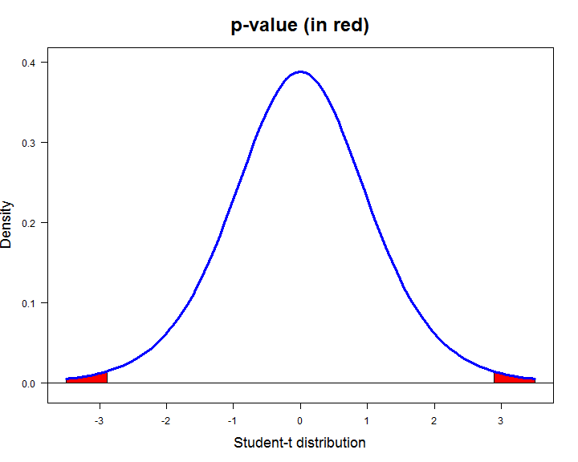

'Test t' Shiny Applet
========================================================
author: canio romaniello
title: Test t
date: Sat Jul 19 03:04:30 2014
transition: concave
transition-speed: slow
type: prompt
font-family: "Georgia"
incremental: true
navigation: slide
rtl: false


'Read Data' Panel
==============================================================
type: prompt

The Applet is formed into two panel.

- "Read Data" Panel allows people to upload a file in which are stored data of variables:
 - Data are read only from file.
 - It's supposed that the X variable is stored in the first column of the file and the Y variable is stored in the second column of the file.
 - File may or may not have a header.
 - Field separator characters enabled are: "blank", "tab", "comma", "semicolon".


'Test options & Summary' Panel [1]
=================================================================
type: prompt

'Test options & Summary' Panel allows people to set up options for runnig the test:

 - must it run a one-sample test or a two-sample test?
 - what is the value of null hypothesis?
 - is a two-sided or one-sided test?
 - are data paired or not?
 - are variances equal or not?
 - what confidence level for the mean's confidence interval?

---

... Run, then results are showed:

- the value of t statistics;
- the p-value corresponding to t statistic;
- the confidence interval for the mean;
- a plot of p-value are printed also.


'Test options & Summary' Panel [2]
===========================================================================
type: prompt

Here is the code of p-value plot ...

```r
t<- -2.89   # value of t statistic
n<- 10  # number of observations
curve(dt(x,n-1),-3.5,3.5,lwd=3, main="p-value (in red)",cex.main=2, col='blue',
      ylab="Density", cex.lab=1.5, xlab="Student-t distribution", las=1,asp=12)
abline(h=0)
xx<- c(seq(abs(t),3.5,by=0.01), 3.5, abs(t))
m<- length(xx)
polygon(xx, c(dt(xx[1:(m-2)], n-1),0,0), col='red')
yy<- c(seq(-abs(t), -3.5,by=-0.01), -3.5, -abs(t))
polygon(yy, c(dt(yy[1:(m-2)],n-1),0,0), col='red')
curve(dt(x,n-1),-3.5,3.5,lwd=3, col='blue', add=T)
```


'Test options & Summary' Panel [4]
===========================================================================
type: prompt

... and the plot

 


